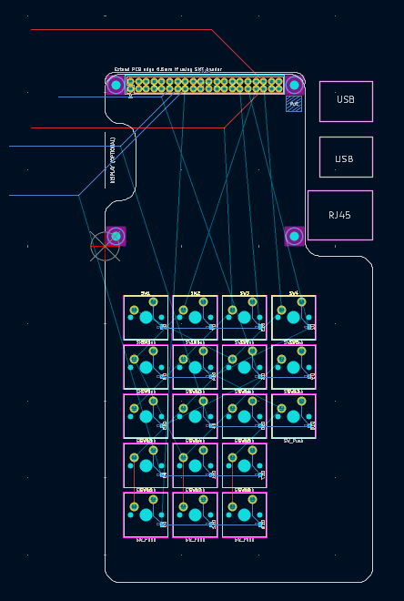
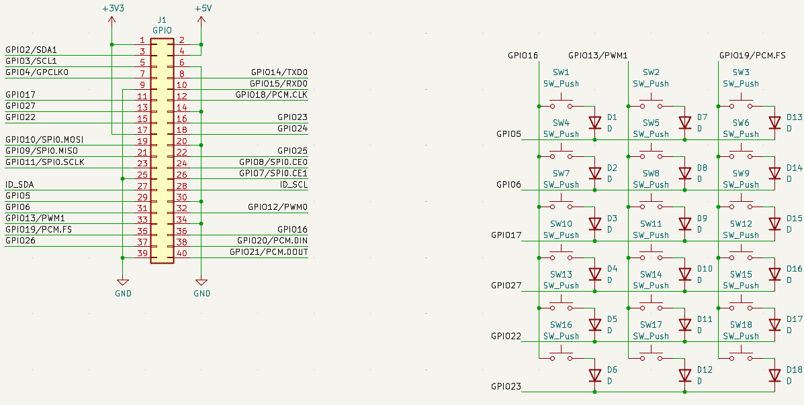
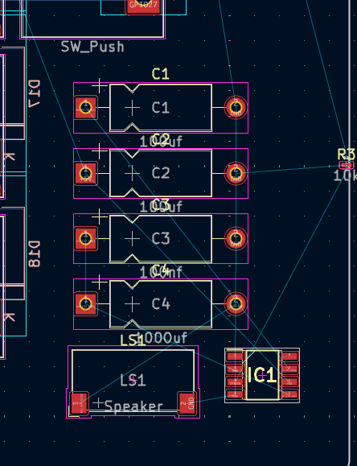
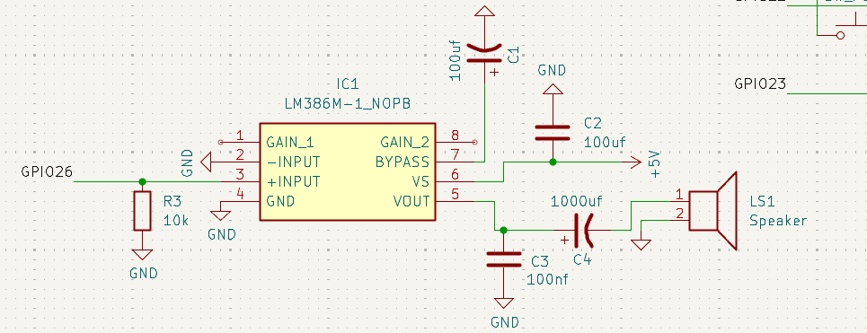
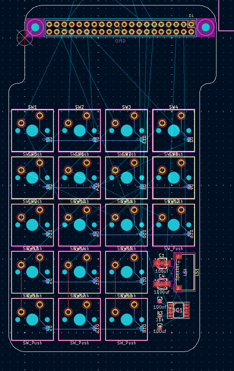
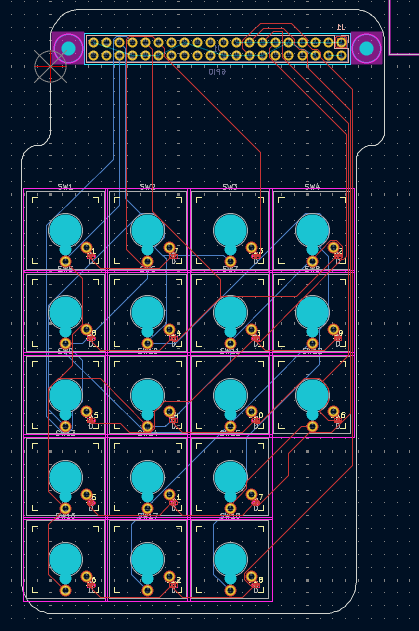
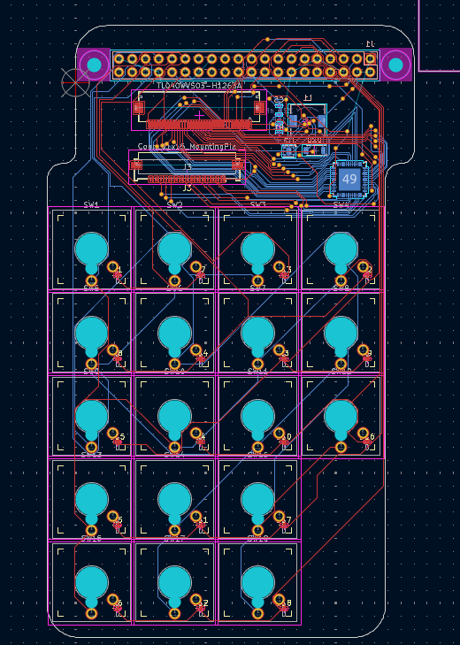
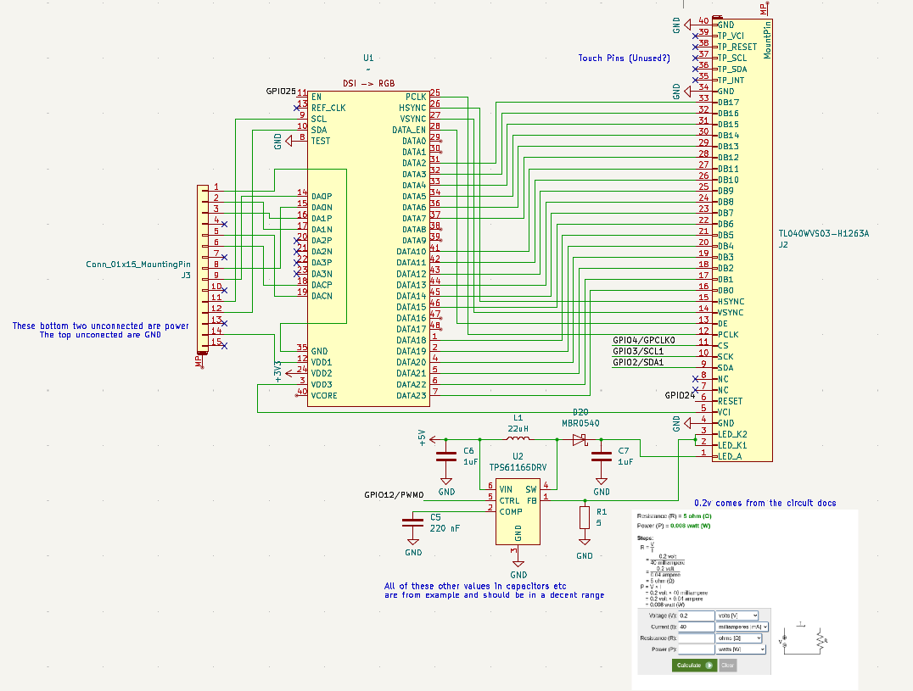

# June 1st: Keyboard Barbones

Got KiCad set up because my GTK color scheme made the text unreadable. I start
the project using a 40 pin Pi hat template. Made a quick keyboard layout with
https://www.keyboard-layout-editor.com/ so I can easily create a schematic and
have it's footprints placed with the aptly named `Keyboard layout placer`
plugin. I played with Edge.Cuts for a while to try to get a good looking PCB,
but right now it's slightly too big. 

**Total time spent: 3h**

# June 20th: Speaker

Following some tutorials online I find speaker + amplifier setup to replicate so
the Pi can emit sounds. I also end up figuring out the difference between SMD
and THT.

**Total time spent: 1h**

# June 21st: Cleanup

Bear organizes some of our folders and looks through the design.

**Total time spent: 20m**

# June 26th: Flip PCB 

We start putting the PCB and case into a single OnShape project to have a good
idea where we're at in terms of design. I flip the 40pin header to let us expose

**Total time spent: 10m**

# July 22nd: Slimming Down Border

I massively reduce the amount of space the PCB takes up, I also shift the
keyboard from the pin header to allow the keyboard to be centered.

**Total time spent: 20m**

# August 5th: Routing

I learn routing! I also remove the speaker from the PCB after buying the parts
and realizing the Pi would be be unable to produce analog signals without a DAC,
so to reduce complexity and focus on bare minimum functionality I remove the
design.

**Total time spent: 2h**

# August 21st: Screen 

So we buy a screen that we think will work with the Pi's DSI port. After it
arriving we find it's port, while also being an FFC MIPI device does not have
the same DSI protocol nor the same type of connector instead of looking for a
new screen we decide to make an adapter converting the DSI signals from the Pi
to RGB using a chip sugested on the Adafruit listing. I spend a ton of time just
reviewing the three documents checking wiring. An additional complication is the
backlight. The led is rated for 12.8v at 40mA which is not what the Pi natively
produces. So we need an additional boost converter to turn down the current and
pump up the volts.

**Total time spent: 6h**

# August 22nd: Screen Adjustments

With functionality theoretically in place Bear and I start to go back through
the circuit double checking resistors, wirings and PCB shape. I add a resistor
to protect the LED in case the boost converter is slightly off. To avoid
resizing the PCB I also move up the bottom so it fits snug in the case.

**Total time spent: 30m**

# August 26th: Ground Plane

Bear added a groundplane to the back of the PCB while adjusting some of the
routes. He also adjusted the positioning of the RGB Display port to make sure
everything would be aligned when produced.

**Total time spent: 1h**

